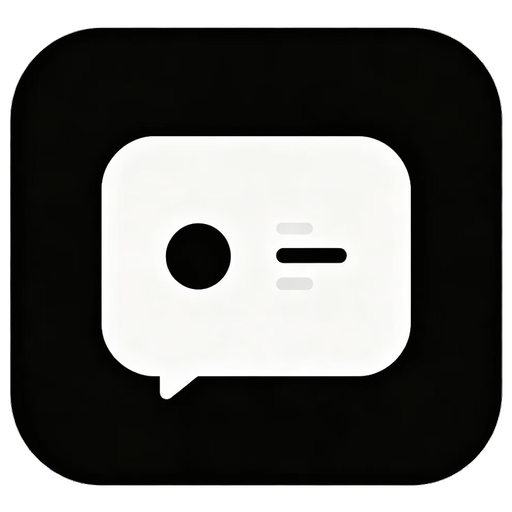
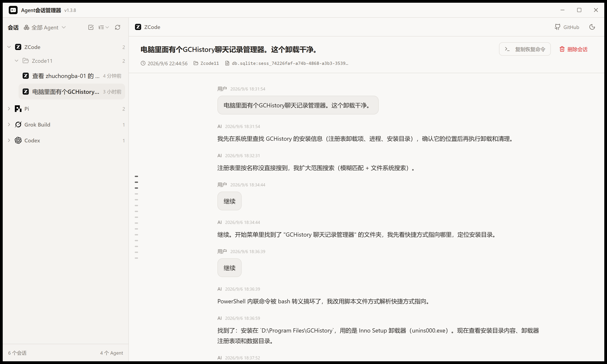

<div align="center">



# Agent 会话管理器

**一款轻量的桌面应用，统一浏览、恢复与安全删除本地编码 Agent 的会话记录。**

[](https://github.com/zhuchongba-01/AgentSessionManager/releases)
[](./LICENSE)
[](https://github.com/zhuchongba-01/AgentSessionManager/releases)



*主界面：左侧按 Agent 与项目分组的会话列表，中间会话缩略导航，右侧完整会话详情。*

</div>

## 这是什么

面向本地编码 Agent 的独立会话浏览、分类、恢复与安全删除工具。

当前支持扫描 **Codex、Claude Code、OpenCode、ZCode、Pi 与 Grok Build** 六种 Agent 的本地会话。项目归类优先遵循各 Agent 自身保存的项目绑定；删除真实工作目录时会检查同目录下的其他 Agent 会话，并将目录移入系统回收站。

## 主要特性

- 🔍 **六种 Agent，一个界面**：Codex、Claude Code、OpenCode、ZCode、Pi、Grok Build 的本地会话一站式浏览。
- 🗂️ **项目分组 + 缩略导航**：会话按真实工作目录归组，紧凑型列表配合缩略导航快速定位。
- 📖 **完整会话详情**：按时间线阅读对话内容，一键复制恢复命令，支持跨平台终端恢复。
- 🧹 **安全清理**：残留会话识别、批量删除与 Codex 桌面索引清理；删除进入系统回收站，真实工作目录默认保护，共享目录需二次确认。
- 💻 **纯本地运行**：扫描、展示与摘要全部在本机完成。

## 下载安装

前往 [Releases](https://github.com/zhuchongba-01/AgentSessionManager/releases) 下载 `AgentSessionManager-Setup-vX.Y.Z.exe`（Windows x64 安装包，无需预装运行时）。

## 开发

```powershell
pnpm install
pnpm tauri dev
```

## 验证

```powershell
pnpm typecheck
pnpm test:unit
cargo test --manifest-path src-tauri/Cargo.toml session_manager
```

## 致谢

特别感谢 [LINUX DO](https://linux.do) 社区！！更多信息请参阅 [ACKNOWLEDGMENTS.md](./ACKNOWLEDGMENTS.md)。

## 开源许可

本项目采用 [MIT License](./LICENSE) 开源。
