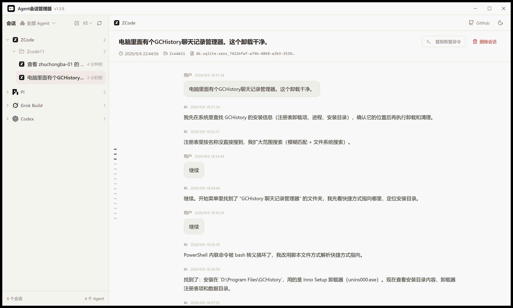

<div align="center">


# Agent 会话管理器

**Codex、Claude Code、DeepSeek Harness 等本地编码 Agent 的会话管理工具**

本地优先的桌面应用：统一浏览、搜索、分类与安全清理 Codex、Claude Code、DeepSeek Harness 等 AI 编程助手的历史会话、对话记录与聊天记录，数据全部留在本机。

<sub>Desktop session manager for local coding agents — browse, group and safely clean up Codex, Claude Code, DeepSeek Harness, OpenCode, ZCode, Pi and Grok Build sessions on Windows and Linux.</sub>

[](https://github.com/zhuchongba-01/AgentSessionManager/releases)
[](./LICENSE)
[](https://github.com/zhuchongba-01/AgentSessionManager/releases)



*主界面：左侧按 Agent 与项目分组的会话列表，中间会话缩略导航，右侧完整会话详情。*

</div>

## 这是什么

面向本地编码 Agent 的独立会话管理工具：浏览、搜索、分类与安全清理历史会话。当前版本不负责启动 Agent 或恢复会话，需要恢复会话请在原 Agent 中操作。

当前支持扫描 **Codex、DeepSeek Harness、Claude Code、OpenCode、ZCode、Pi 与 Grok Build** 七种 Agent 的本地会话。项目归类优先遵循各 Agent 自身保存的项目绑定。

## 支持的 Agent 与会话位置

| Agent | 会话数据位置 |
| --- | --- |
| Codex | `~/.codex`（`config.toml`、`state_5.sqlite`、`thread_history_1.sqlite`），可用 `CODEX_HOME` 覆盖 |
| Claude Code | `~/.claude/projects`，可用 `CLAUDE_CONFIG_DIR` 覆盖 |
| DeepSeek Harness | `~/.dsh/sessions` |
| OpenCode | `~/.local/share/opencode`（遵循 `XDG_DATA_HOME`） |
| ZCode | `~/.zcode/cli/db/db.sqlite`、`~/.zcode/v2/tasks-index.sqlite` |
| Pi | `~/.pi/agent`，可用 `PI_CODING_AGENT_DIR` 覆盖 |
| Grok Build | `~/.grok/sessions`、`~/.grok/archived_sessions`，可用 `GROK_CONFIG_DIR` 覆盖 |

Windows 下 `~` 即 `%USERPROFILE%`。本管理器只读取上述文件，不改写各 Agent 的内部格式。

## 主要特性

- 🔍 **七种 Agent，一个界面**：Codex、DeepSeek Harness、Claude Code、OpenCode、ZCode、Pi、Grok Build 的本地会话一站式浏览。
- 🗂️ **项目分组 + 缩略导航**：遵循 Agent 的项目绑定与 Codex 自定义侧边栏分区，紧凑型列表配合缩略导航快速定位。
- 📖 **完整会话详情**：按时间线阅读本地 Agent 的对话内容，快速定位历史消息。
- 🧹 **安全清理**：识别残留、归档和仅剩索引的任务，支持批量删除与失败后继续清理；会话清理绝不删除项目工作目录。
- 🛡️ **明确失败而非假装为空**：扫描不完整或消息读取失败时显示原因，并限制超大会话的单次读取量。
- 📚 **长历史可控**：会话列表每页最多显示 100 条，消息按可视区域渲染。
- 💻 **会话数据留在本机**：扫描、展示与摘要全部在本机完成，不上传会话内容；启动时仅访问 GitHub API 检查新版本。

删除前请完全退出对应 Agent（包括后台进程、终端任务），并自行备份重要会话。详细边界见 [SAFETY.md](./SAFETY.md)。

## 下载安装

前往 [Releases](https://github.com/zhuchongba-01/AgentSessionManager/releases) 下载安装包，无需预装运行时。

**Windows x64**：下载 `AgentSessionManager-Setup-vX.Y.Z.exe`，关闭旧版管理器后运行安装包。

**Linux amd64**（Ubuntu 24.04 已测试）：下载 `AgentSessionManager-X.Y.Z-amd64.deb` 后安装。

```bash
sudo apt install ./AgentSessionManager-X.Y.Z-amd64.deb
```

> [!IMPORTANT]
> 本程序暂未进行商业代码签名。Edge 首次下载时可能提示“不常下载”，请选择“保留”；Windows SmartScreen 如显示“Windows 已保护你的电脑”，请点击“更多信息” → “仍要运行”。请只从本仓库的 Releases 页面下载安装包。

## 常见问题

**Codex 的历史会话在哪里？**
Codex 把会话数据放在 `~/.codex`，包含 `config.toml`、`state_5.sqlite`、`thread_history_1.sqlite`；设置 `CODEX_HOME` 可以改用其他目录。本管理器直接读取这些文件。

**怎么删除或清理 Codex / Claude Code 的会话记录？**
在列表中选中会话后删除，支持批量删除与失败后继续清理。删除前请完全退出对应 Agent；清理只删除会话本身，不会删除项目工作目录。

**Claude Code 的会话文件存在哪里？**
`~/.claude/projects`，可用 `CLAUDE_CONFIG_DIR` 指向其他位置。

**会话内容会被上传吗？**
不会。扫描、展示与摘要全部在本机完成，只在启动时访问 GitHub API 检查新版本。

**Codex 的对话记录怎么查看？**
打开本管理器，按 Agent 与项目分组即可浏览 Codex 的历史会话和对话内容，不需要敲命令行。

**删除的会话能恢复吗？**
不能。会话文件与数据库记录是永久删除，不进入回收站，删除前请手动备份重要会话；列表里的“继续清理”只用于收尾未完成的删除，不提供撤销。

**会话记录太多、太占空间，怎么批量清理？**
在列表里多选后删除，支持批量删除与失败后继续清理；清理只处理会话本身，不会删除项目工作目录。

**支持 Windows 和 Linux 吗？**
两者都提供安装包（Windows exe / Linux deb），macOS 暂未发布。

**支持哪些 AI 编程助手？和同类会话管理工具相比有什么不同？**
Codex、Claude Code、DeepSeek Harness、OpenCode、ZCode、Pi、Grok Build 共七种，一个界面全部覆盖，同时提供 Windows 与 Linux 安装包，而不是只支持单一 Agent 或只支持 macOS。

<sub>Keywords: codex session manager · codex history viewer · claude code session viewer · coding agent session manager · agent session browser · session transcript viewer · local-first · AI coding agent session cleaner · Windows · Linux.</sub>

<sub>关键词：Codex 会话管理 · Codex 对话记录查看 · Claude Code 历史会话 · Claude Code 会话浏览 · DeepSeek Harness 会话日志 · AI 编程助手会话管理 · 编码 Agent 会话清理 · 删除会话记录 · 本地会话查看器 · 会话记录留在本机 · Windows 与 Linux 桌面应用。</sub>

## 开发

```powershell
pnpm install
pnpm tauri dev
```

Ubuntu 24.04 下开发与打包需先安装系统依赖：

```bash
sudo apt install -y build-essential curl file wget \
  libwebkit2gtk-4.1-dev libgtk-3-dev libayatana-appindicator3-dev \
  librsvg2-dev libxdo-dev
pnpm install --frozen-lockfile
```

## 验证

```powershell
pnpm version:check
pnpm test:version
pnpm typecheck
pnpm format:check
pnpm test:unit
pnpm build:renderer
cargo fmt --manifest-path src-tauri/Cargo.toml -- --check
cargo clippy --manifest-path src-tauri/Cargo.toml --locked --all-targets -- -D warnings
cargo test --manifest-path src-tauri/Cargo.toml --locked
```

GitHub Actions 在 Windows 上执行上述检查，并在 Ubuntu 24.04 上运行 `pnpm build:linux` 产出 `.deb` 与 AppImage 制品。Node 与 Rust 版本分别读取 `.node-version` 和 `rust-toolchain.toml`，pnpm 版本读取 `package.json` 的 `packageManager`。CI 不创建 Release。

## 更新版本与打包

```powershell
# 仅接受 X.Y.Z 正式版号；不创建 Git 提交或标签
pnpm version:set 1.3.17
pnpm version:check
pnpm build:installer   # Windows：Tauri 构建 + Inno Setup
pnpm build:linux       # Linux：输出 .deb 与 AppImage
```

`version:set` 同步更新 package.json、Cargo.toml、Cargo.lock 中的本项目版本、Tauri 版本和窗口标题、Inno Setup 版本，不修改依赖版本。脚本先检查所有目标字段，再写入变更；请在无并发编辑时运行，并检查 Git diff。`version:check` 以 package.json 为准，只读检查版本一致性。标准 `pnpm build` 和 Inno Setup 打包前也会检查版本。

版本脚本不依赖 node_modules，也可直接运行 `node scripts/version.mjs --check` 或 `node scripts/version.mjs 1.3.17`。版本脚本测试使用临时目录，不修改项目版本文件。

## 致谢

特别感谢 [LINUX DO](https://linux.do) 社区！！更多信息请参阅 [ACKNOWLEDGMENTS.md](./ACKNOWLEDGMENTS.md)。

## 开源许可

本项目采用 [MIT License](./LICENSE) 开源。
